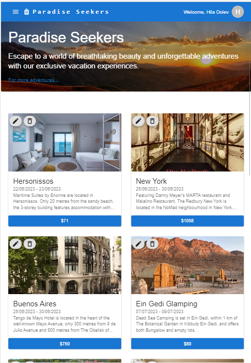

# Vacations website

The website is a vacation management system with user roles, offering functionality to manage and view vacations.

<p align="center">
  
</p>

## Description

The website is a vacation management platform with guest, user, and admin roles. Users can browse vacations in the feed, follow, and filter them. Admins have additional options to edit and remove vacations and access reports. Navigation varies by role, creating an intuitive and comprehensive user experience.

## Getting Started

### Prerequisites

<ul>
<li>React</li>
<li>Typescript</li>
<li>Node.js</li>
<li>Express</li>
<li>Docker</li>
</ul>

## Installation

```python
# Clone repository

git clone https://github.com/Hiladolev/Travel

# Install NPM packages - backend

cd backend
npm i

# install NPM packages - frontend

cd frontend
npm i

# Run the development server

cd backend
npm start

# Run the development client

cd frontend
npm start
```

Copyright © 2023 by <a href="https://github.com/Hiladolev" target="_blank">Hila Dolev</a>
